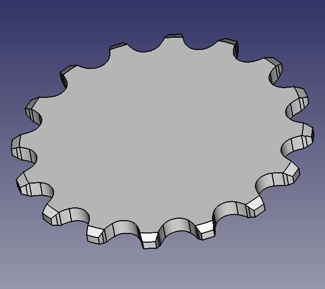

# FreeCAD module that helps to create sprockets (aka. chainwheels)

## Installation

Simply install module by executing:

```bash
$ pip install ./
```

## Supported sprockets types

### ANSI

Standard sprocket that looks like


Also has ability of addition teeth cut and chamfers such



### Hub

Simple sprocket with straightforward design and without additional abilities.


## References

Wealth of design information was taken from two resources:

* [Designing and Drawing a Sprocket](http://www.gearseds.com/files/design_draw_sprocket_5.pdf)
* [Sprocket Design Tutorial](https://www.chiefdelphi.com/t/sprocket-design-tutorial/387449)

## License

GNU General Public License v3.0
